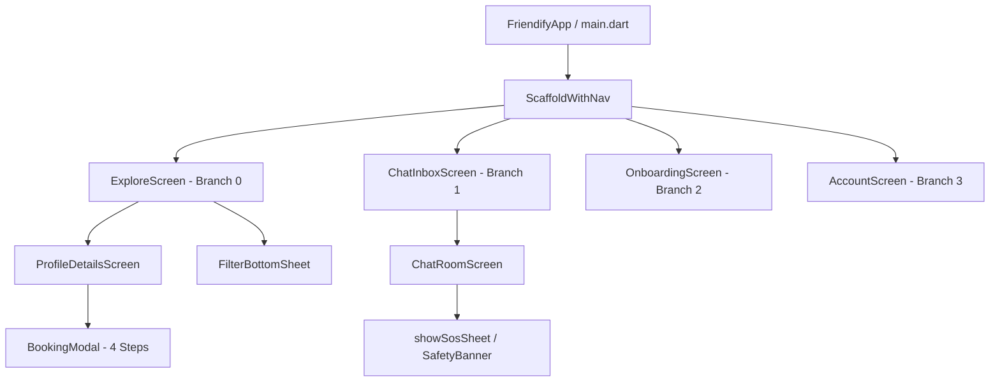
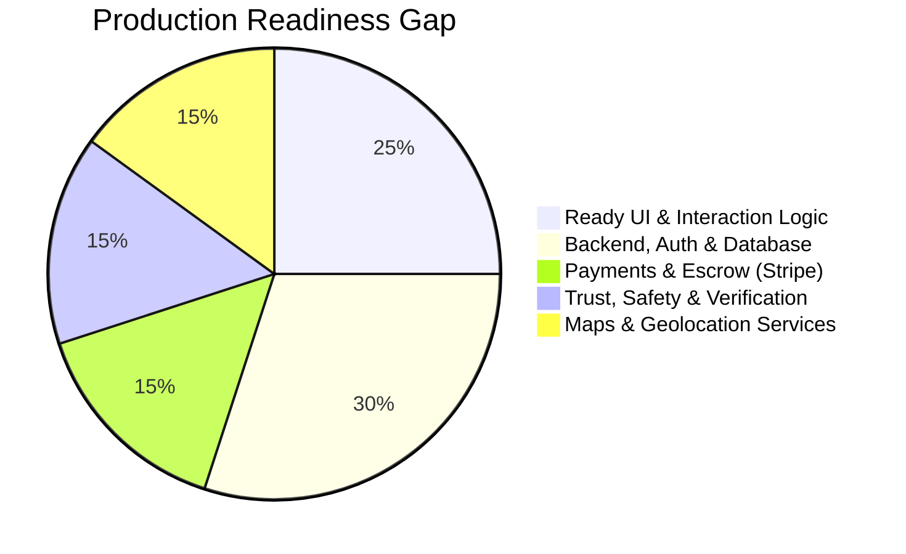
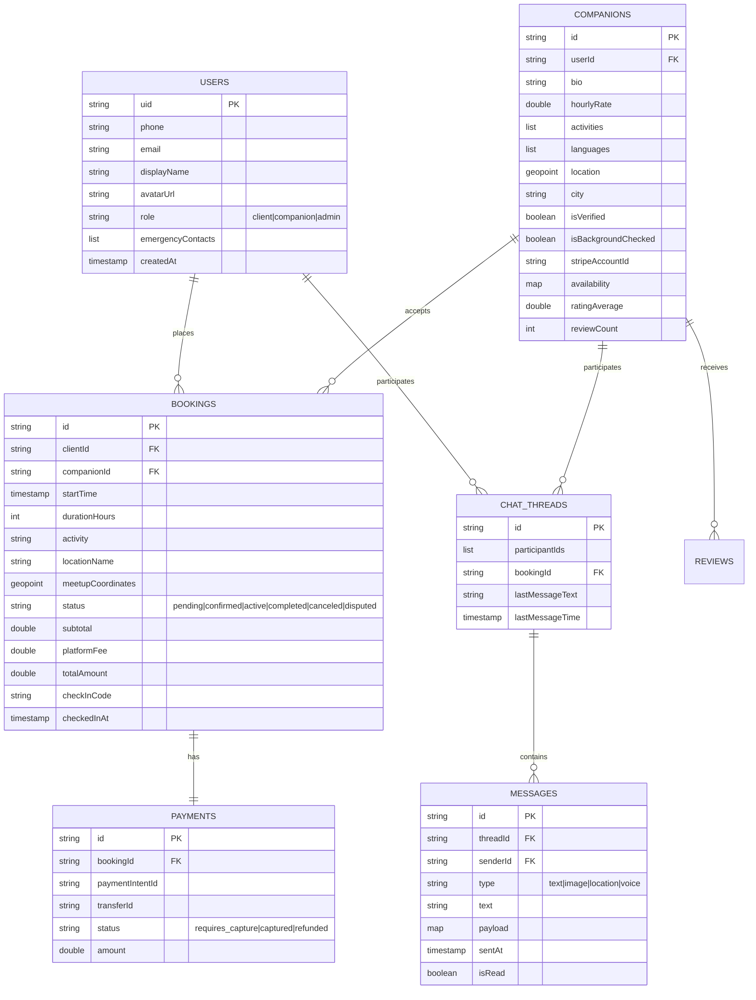
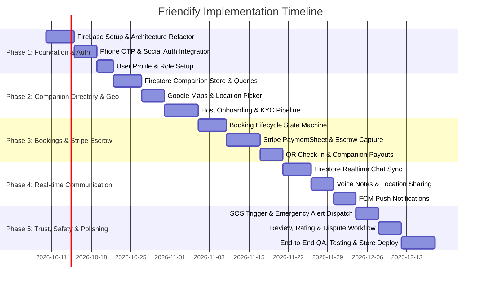

# Friendify — Project Analysis & Production Implementation Plan

## 1. Executive Summary & Vision

**Friendify** is a mobile-first marketplace platform designed for **platonic companionship and shared social activities** (e.g., coffee chats, gym buddies, event plus-ones, city sightseeing, museum visits, board games). 

Unlike dating or escort applications, Friendify’s primary differentiator and legal/brand prerequisite is **strict platonic safety, verified trust, transparent escrow pricing, and zero tolerance for harassment**.

---

## 2. Current State Analysis

### 2.1 Architectural Overview
The codebase currently represents a **high-fidelity Flutter UI prototype** using modern Flutter architecture patterns:
- **Framework**: Flutter 3.44+ (Dart 3.12+) with Material 3 design system.
- **State Management**: `flutter_riverpod: ^2.6.1` with `Notifier` and `FutureProvider` patterns.
- **Routing**: `go_router: ^14.8.1` with `StatefulShellRoute.indexedStack` (preserves bottom nav branch state across Explore, Chat, Host, and Account).
- **Internationalization/Formatting**: `intl: ^0.19.0`.

### 2.2 Component Breakdown & File Inventory

| Area | Current Implementation | Status | Deficiencies / Technical Debt |
| :--- | :--- | :--- | :--- |
| **Authentication** | Absent | 🔴 Missing | No user sessions, guest restrictions, or user profiles. |
| **Data Layer** | `MockCompanionRepository`, `MockBookingRepository` in [repositories.dart](file:///d:/Android%20Projects/friendify/lib/repositories/repositories.dart) | 🟡 Mocked | Hardcoded in-memory dummy list with fake pravatar URLs. Data resets on reload. |
| **Search & Filtering** | [companion_provider.dart](file:///d:/Android%20Projects/friendify/lib/providers/companion_provider.dart) & [filter_bottom_sheet.dart](file:///d:/Android%20Projects/friendify/lib/widgets/filter_bottom_sheet.dart) | 🟢 Functional Prototype | Client-side in-memory string filtering only. Lacks server-side geospatial/distance queries. |
| **Booking Flow** | 4-step wizard in [booking_modal.dart](file:///d:/Android%20Projects/friendify/lib/screens/booking_modal.dart) | 🟡 Mocked | Step 3 has a mock Google Maps placeholder. Step 4 mock calls `MockPaymentService`. |
| **Payments** | `MockPaymentService` | 🔴 Mocked | Fixed 1-second delay returning `true`. No Stripe Payment Sheet or backend PaymentIntent. |
| **Chat & Messaging** | [chat_screen.dart](file:///d:/Android%20Projects/friendify/lib/screens/chat_screen.dart) | 🟡 Mocked | Local ephemeral state list in `_ChatRoomState`. No WebSockets, Firebase, or push notifications. |
| **Host Onboarding** | [onboarding_screen.dart](file:///d:/Android%20Projects/friendify/lib/screens/onboarding_screen.dart) | 🟡 Mocked | UI Stepper without document uploads, selfie liveness check, or Stripe Connect onboarding. |
| **Trust & Safety** | [safety_banner.dart](file:///d:/Android%20Projects/friendify/lib/widgets/safety_banner.dart) | 🟡 Mocked | Mock SOS sheet showing snackbars. No real GPS dispatch or emergency SMS/call webhook. |

---

## 3. Gap Analysis (Prototype vs. Production)

1. **Authentication & Identity**: Needs Phone OTP (Firebase Auth / Supabase Auth) to verify real phone numbers, plus Google/Apple Sign-in.
2. **Geospatial Proximity**: Currently uses static `distanceKm: 0.8 + i * 1.3`. Real apps require GeoFirestore or PostgreSQL PostGIS queries (`ST_DWithin`) to find companions within X km.
3. **Escrow Financial Pipeline**: Companion services cannot use direct charging. Funds must be **authorized and held in escrow**, released upon QR-code check-in or booking completion, with a 15% platform commission deducted.
4. **Trust, Safety & Compliance**: Government ID upload, automated biometric face-match (e.g., Persona, Sumsub, or Stripe Identity), emergency contact dispatch, and in-chat automated content screening for prohibited behavior.
5. **Real-time Push & Messaging**: Firestore / Supabase Realtime for chat messages, read receipts, and FCM (Firebase Cloud Messaging) for background alerts.

---

## 4. Proposed Production Architecture

### 4.1 Technology Stack Recommendation

| Tier | Recommended Option | Alternative Option | Rationale |
| :--- | :--- | :--- | :--- |
| **Mobile Client** | **Flutter 3.44+** (Existing) | Native Android/iOS | Codebase already has high quality UI components. |
| **Backend & Database** | **Firebase** (Firestore + Cloud Functions + Auth) | **Supabase** (PostgreSQL + PostGIS + Edge Functions) | Firebase dependencies are already outlined in `pubspec.yaml`; Firestore is fast for chat & real-time updates. Supabase is a strong alternative if complex SQL queries or PostGIS are prioritized. |
| **Maps & Places** | **Google Maps Flutter & Google Places API** | OpenStreetMap / Mapbox | Industry standard for address auto-completion and public meetup spot discovery. |
| **Payments & Payouts** | **Stripe Connect & PaymentSheet** | Razorpay / Cashfree (if India-specific) | Companion marketplace requires split payments (buyer payment $\rightarrow$ escrow $\rightarrow$ companion payout via Express account). |
| **Identity / KYC** | **Stripe Identity / Persona** | AWS Rekognition / Digilocker (India) | Automated ID document verification and selfie liveness detection. |

---

## 5. Production Database Schema Design

### 5.1 Firestore / Document Structure

---

## 6. Phased Implementation Roadmap

### Detailed Breakdown:

#### **Phase 1: Foundation & Identity (Sprint 1)**
- [ ] Initialize Firebase project (`flutterfire configure` for Android, iOS, Web).
- [ ] Wire `firebase_core`, `firebase_auth`, and `cloud_firestore`.
- [ ] Implement Phone Number OTP Authentication + Apple/Google Sign-In.
- [ ] Create User Profile screen with role selection (`client` vs `companion`).

#### **Phase 2: Geospatial Search & Host Onboarding (Sprint 2)**
- [ ] Replace `MockCompanionRepository` with real Firestore data store.
- [ ] Implement Geohash indexing / GeoFlutterFire queries for proximity filtering.
- [ ] Integrate `google_maps_flutter` and Google Places autocomplete for meeting point selection in [booking_modal.dart](file:///d:/Android%20Projects/friendify/lib/screens/booking_modal.dart).
- [ ] Build ID document & selfie capture with Cloud Storage upload.

#### **Phase 3: Booking Engine & Escrow Payments (Sprint 3)**
- [ ] Implement Booking State Machine:
  $$\text{Draft} \longrightarrow \text{Pending Companion Approval} \longrightarrow \text{Authorized (Card Held)} \longrightarrow \text{Active (Checked-in)} \longrightarrow \text{Completed (Funds Released)}$$
- [ ] Integrate Stripe PaymentSheet:
  - Client authorizes payment on booking confirmation.
  - Payment is captured upon mutual check-in via QR code or 4-digit PIN.
  - Companion payouts handled via Stripe Express Connect accounts.

#### **Phase 4: Real-Time Chat & Notifications (Sprint 4)**
- [ ] Replace local mock messages in [chat_screen.dart](file:///d:/Android%20Projects/friendify/lib/screens/chat_screen.dart) with real-time Firestore collection listener.
- [ ] Add image sharing, voice message recording, and live location snippets.
- [ ] Implement FCM background notifications for new messages, booking confirmations, and reminders.

#### **Phase 5: Trust, Safety, Ratings & Production Hardening (Sprint 5)**
- [ ] Implement real SOS action in [safety_banner.dart](file:///d:/Android%20Projects/friendify/lib/widgets/safety_banner.dart):
  - Sends immediate push alert & SMS with live GPS link to stored emergency contacts.
  - One-tap local emergency dialer (`tel:112` or `tel:911`).
- [ ] Post-meetup review & star rating system updating companion average metrics.
- [ ] Comprehensive unit, widget, and integration testing across real Android and web devices.

---

## 7. Immediate Decision Matrix for Next Steps

To begin implementation, the key foundational decisions are:

1. **Target Backend Ecosystem**:
   - **Option A (Recommended)**: Firebase (Firestore + Firebase Auth + Cloud Functions). Quickest setup, native FlutterFire support, real-time by default.
   - **Option B**: Supabase (PostgreSQL + PostGIS + Supabase Auth). Better for complex spatial queries and SQL relations.
2. **Target Region & Payment Gateway**:
   - **International**: Stripe (Payment Intents + Stripe Connect for host payouts).
   - **India-centric**: Razorpay / Cashfree (with Route/Marketplace split payouts) + Digilocker / Aadhaar verification.
3. **Target Device Testing**:
   - Run immediately on the connected Android phone (`220733SPI`) or in Chrome for live hot-reload development.
